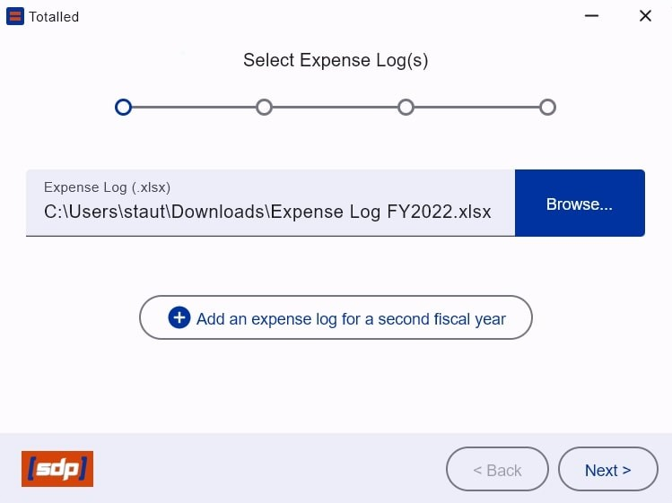
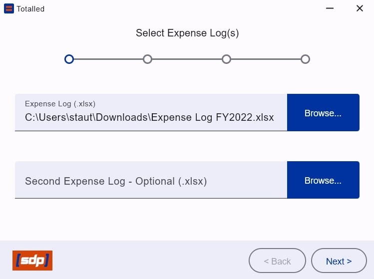
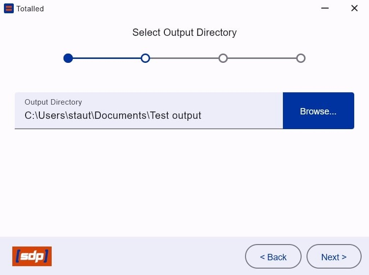
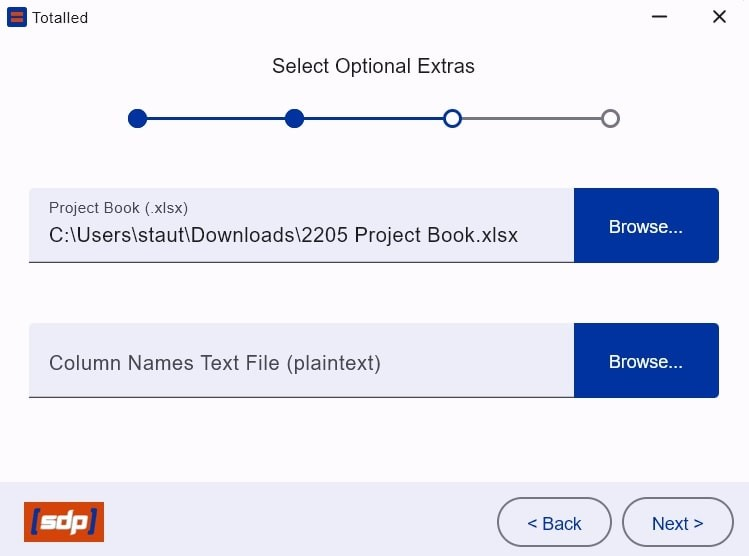
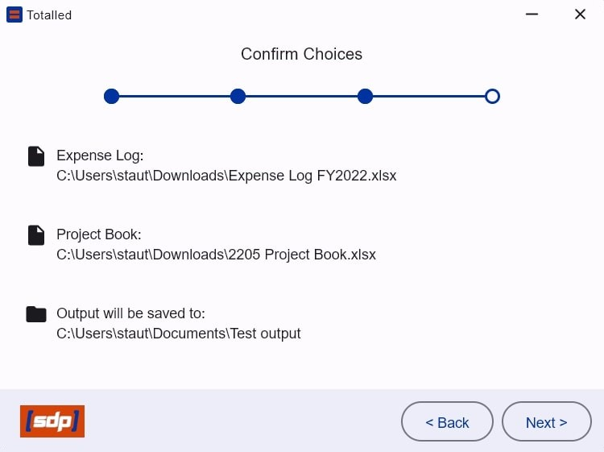
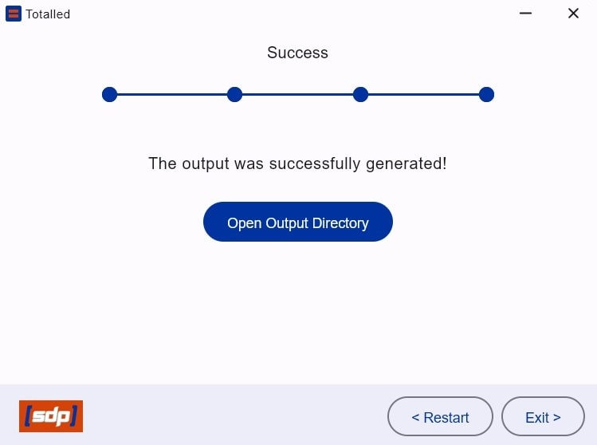

# Desktop Application for Expense Breakdown Invoicing
## Members:
- Bree Latimer
- Chase Stauts
- D Metz
- Paul Ellis

## Abstract:
The Mechanical and Biomedical Engineering Departments run capstone projects, this constitutes significant physical materials that they need to purchase, as well as create invoice and request reimbursements from their sponsors. Currently the Departments are creating their invoices by hand, which is tedious and prone to errors. The goal of this project is to automate the process of creating invoices for each capstone project team that can then be sent to the sponsor.

## Overview:
Totalled uses an Apache POI and Compose Multiplatform in order to create and modify Microsoft Office documents through a native application. This application is run via the JRE and therefore is usable on Linux, Mac, and Windows, but was built with primarily Windows use in mind. The application will take in one or two excel files (to account for carry over from different years) of the Mechanical and Biomedical Engineering Departments file structure, parse through the information relevant specifically to the capstone projects and isolate them into groups. Once the groups are created, resulting expense breakdowns excel files are created for each group. If there is no need to calculate an invoice request the expense breakdown includes purchase details such as: price, item description, vendor, group name, date, and card type. These results are then totalled based on taxable fields and then finalized as Excel and google sheets accessible files. The program can also take a project book excel file and a column name text file as optional inputs. The project book contains details about each team's sponsor, including things like name, email, and address. If a project book is selected, then a invoice request file will be generated. The column name text file describes the column names in the expense log(s) and project book, allowing the column names to be changed in the input format later without modifying the source code.

*Select Expense Log Input*

&nbsp;

*Optional Expense Log Input*

&nbsp;

*Select Output Directory*

&nbsp;

*Optional Material Invoice Input*

&nbsp;

*Confirmation Detailing Screen*

&nbsp;

*Completion Response*
